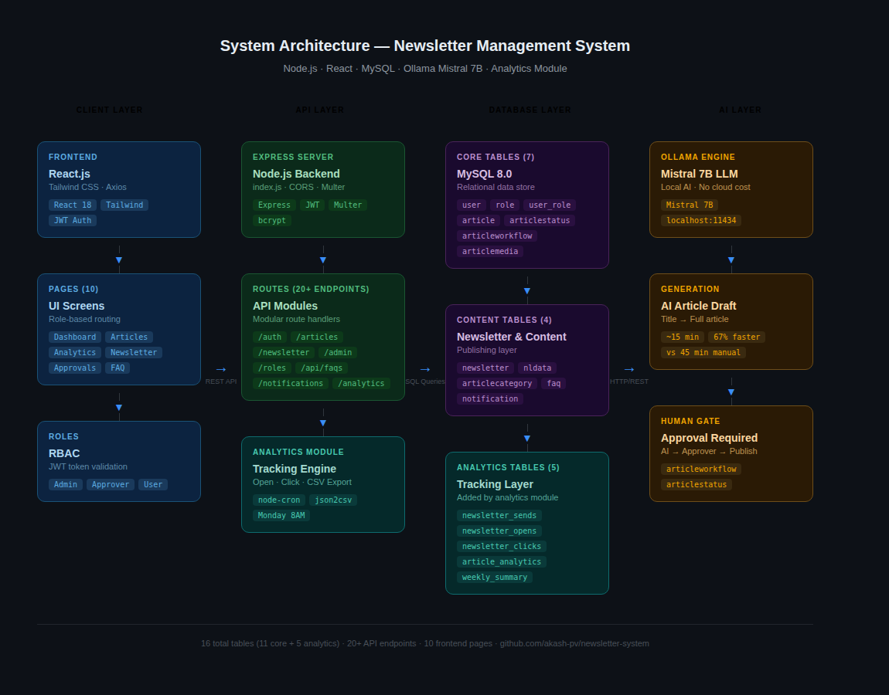
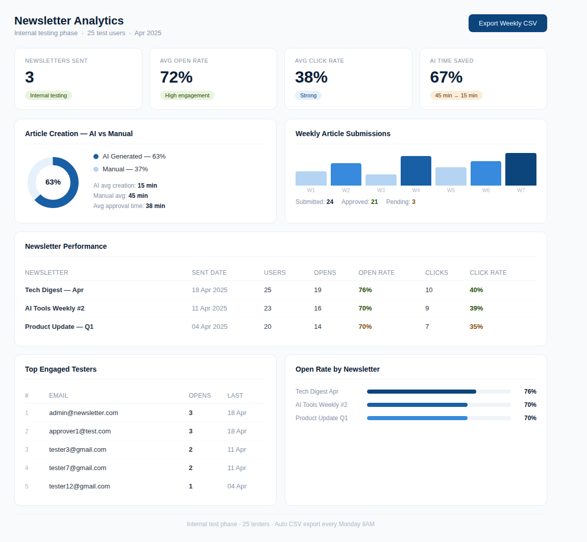
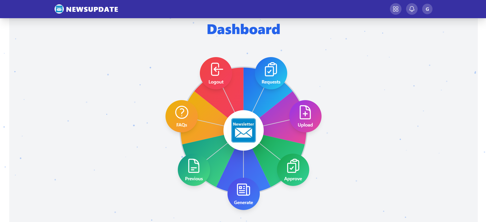
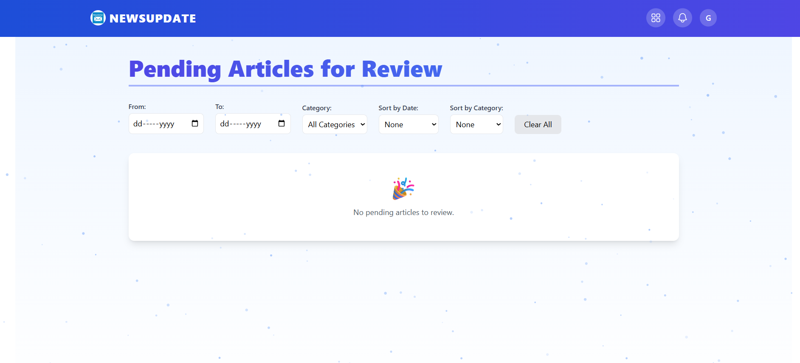
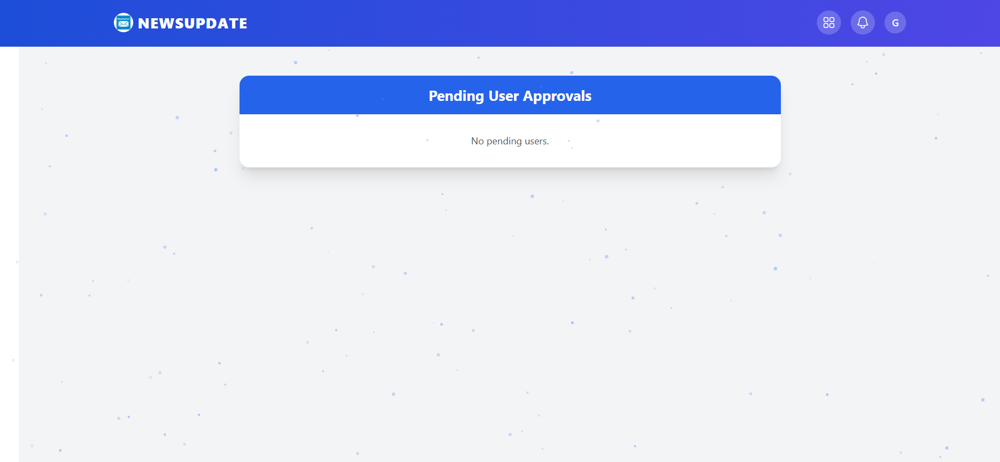
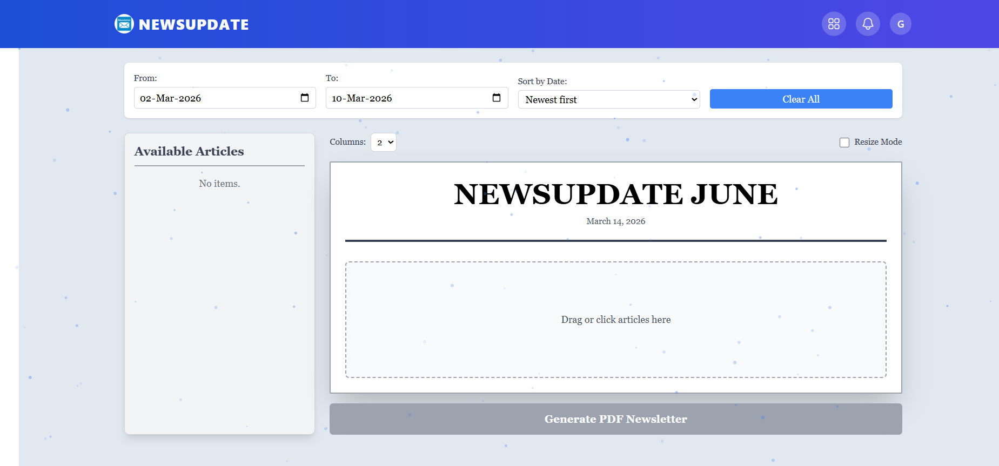
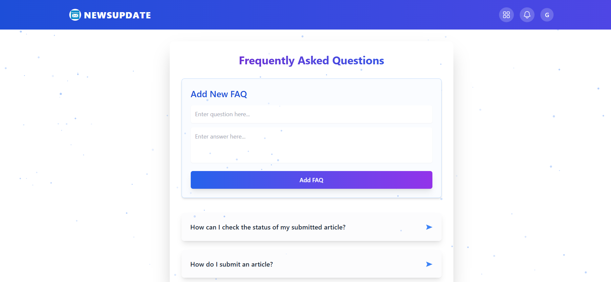

# Newsletter Management System

A full-stack Newsletter Management System with role-based workflows, AI-powered article generation using Ollama Mistral, and a built-in Analytics Module tracking open rates, click-through rates, and content performance.

---

## What This Project Does

Users submit articles — manually or using AI — which go through a structured approval workflow before being assembled into newsletters using a drag-and-drop builder. Admins publish the final newsletter as a PDF. An analytics layer tracks how subscribers engage with each newsletter and exports automated weekly reports.

**Built with:** Node.js · Express.js · React.js · MySQL · Tailwind CSS · Ollama Mistral 7B

---

## Features

### Core System
- Role-based access control — Admin, Approver, and User roles with JWT authentication
- Article submission workflow — multi-stage submit → review → approve → publish pipeline
- Drag-and-drop newsletter builder — visually compose newsletters from approved articles
- PDF generation — export finalized newsletters as downloadable PDFs
- Media upload support — images and attachments

### AI Integration
- Ollama Mistral 7B — local AI model for article generation from a single title prompt
- 67% faster content creation — AI drafts articles in ~15 minutes vs ~45 minutes manually
- Human-in-the-loop — all AI content goes through the same approval workflow as manual articles

### Analytics Module
- Real-time open rate and click-through rate tracking per subscriber
- AI vs manual article creation time and approval time comparison
- Top subscriber engagement leaderboard
- Automated weekly CSV export — runs every Monday at 8AM
- Admin analytics dashboard with KPI cards, bar charts, and performance tables

---

## System Architecture



The system is divided into four layers:

**Client Layer** — React.js frontend with Tailwind CSS, communicating via REST APIs with JWT-based authentication and role-based routing.

**Application Layer** — Express.js backend handling all business logic including article workflows, newsletter generation, AI integration, and the analytics tracking engine.

**Data Layer** — MySQL relational database storing users, articles, roles, newsletter sends, and 5 dedicated analytics tables for open/click tracking and weekly summaries.

**AI Layer** — Ollama running Mistral 7B locally, exposed via REST API. Articles are drafted from a title prompt, reviewed by an approver, and published through the standard workflow.

---

## Article & Newsletter Workflow


### Standard Path
1. User submits an article (manual or AI-generated)
2. Approver reviews and approves or rejects
3. Admin selects approved articles and builds a newsletter using the drag-and-drop builder
4. Newsletter is exported as PDF and sent to subscribers
5. Analytics module automatically tracks opens and clicks

### AI Generation Path
1. User enters an article title
2. Ollama Mistral generates a full draft in ~15 minutes
3. Draft enters the same approval queue as manual articles
4. Approver reviews AI content before it reaches the newsletter

---

## Analytics Dashboard



---

## Application Screenshots

### Main Dashboard


### Login Page


### Article Review


### User Approval


### Generate Newsletter


### FAQ Page


---

## Database Schema

### Core Tables
```
user                  — user accounts with roles and approval status
role                  — role definitions (Admin, Approver, User)
user_role             — user-role mapping
article               — submitted articles with title, content, author
articlecategory       — article categorisation
articlestatus         — approval workflow states per article
articleworkflow       — full audit trail of status changes
articlemedia          — media attachments for articles
newsletter            — published newsletters with metadata
nldata                — newsletter content and PDF storage
notification          — user notifications for approvals and rejections
faq                   — FAQ entries
```

### Analytics Tables
```
newsletter_sends          — every newsletter sent (recipients, article count, timestamp)
newsletter_opens          — per-subscriber open events
newsletter_clicks         — per-subscriber click events with article reference
article_analytics         — creation time, approval time, AI vs manual flag
weekly_analytics_summary  — weekly snapshot table for CSV export
```

---

## Analytics — Internal Test Results (25 testers)

| Newsletter | Sent To | Opens | Open Rate | Clicks | Click Rate |
|---|---|---|---|---|---|
| Tech Digest — Apr | 25 | 19 | 76% | 10 | 40% |
| AI Tools Weekly #2 | 23 | 16 | 70% | 9 | 39% |
| Product Update — Q1 | 20 | 14 | 70% | 7 | 35% |

---

## Tech Stack

| Layer | Technology |
|---|---|
| Frontend | React.js, Tailwind CSS |
| Backend | Node.js, Express.js |
| Database | MySQL |
| AI Engine | Ollama (Mistral 7B) |
| Scheduling | node-cron |
| CSV Export | json2csv |

---

## Environment Variables

| Variable | Description |
|---|---|
| `PORT` | Backend server port (default: 5000) |
| `DB_HOST` | MySQL host |
| `DB_USER` | MySQL username |
| `DB_PASSWORD` | MySQL password |
| `DB_NAME` | MySQL database name |
| `JWT_SECRET` | Secret key for JWT tokens |
| `OLLAMA_URL` | Ollama API base URL (default: http://localhost:11434) |

---

## License

Copyright © 2025 Akash PV. All rights reserved.

This repository is made available for portfolio and demonstration purposes only.
Unauthorized copying, modification, distribution, or commercial use of this code
without explicit written permission from the author is strictly prohibited.
